<div align="center">

# स्वच्छ भारत · Clean Bharat

### Community Waste Reporting Platform — Web Client

**A citizen photographs an uncollected waste site. Minutes later a sanitation officer has the coordinates, the neighbourhood is watching, and the cleanup is on the public record.**
*This repository is the interface that makes all of that feel like one continuous action.*

<br />


<br />

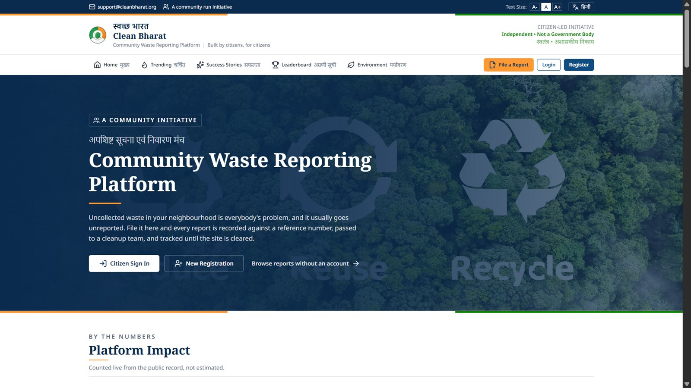

<sub>The landing page. Bilingual navigation, an accessibility control in the utility bar, and a counter row that is read from the public record rather than written by hand.</sub>

</div>

---

## Contents

| | |
|---|---|
| **[Why this frontend exists](#why-this-frontend-exists)** | the problem the interface is solving |
| **[The product in fifteen screens](#the-product-in-fifteen-screens)** | annotated tour, grouped by audience |
| **[What each role can do](#what-each-role-can-do)** | capability matrix |
| **[The life of a report, from the UI side](#the-life-of-a-report-from-the-ui-side)** | five stages, five surfaces |
| **[Engineering notes](#engineering-notes)** | the decisions worth explaining |
| **[Project structure](#project-structure)** | annotated `src/` |
| **[Getting started](#getting-started)** | install, configure, run |
| **[Deployment](#deployment)** | SPA rewrites, caching, headers |
| **[Roadmap](#roadmap)** · **[Credits](#acknowledgements)** | what is next, and who built it |

---

## Why this frontend exists

Uncollected waste is rarely a mystery to the people living beside it. They know exactly which corner floods with plastic after every market day. What they usually lack is a way to say so that survives longer than a phone call — something with a photograph attached, a reference number, a visible queue, and an outcome anyone can check afterwards.

That is the entire brief for this client:

- **Make reporting take under a minute.** One photograph, one heading, one location — captured from the device rather than typed from memory.
- **Make the queue public.** Every report, every rating, every comment and every completed cleanup is readable **without an account**. Participation needs a login; observation does not.
- **Make the outcome undeniable.** A cleanup is published as a before-and-after pair carrying the AI verification confidence that closed it — not as a status field flipped to `RESOLVED`.
- **Make it usable in the country it is for.** Every heading, every navigation label and every status word appears in English and Hindi, and the text size can be raised from the header without a browser zoom.

> **This is the web client only.** The Spring Boot API — JWT authentication, Gemini Vision image validation, duplicate detection, Cloudinary storage, assignment lifecycle, reward points and leaderboard computation — lives in the companion **`wastemanagement`** repository. Read its README first if you want to understand *why* a screen behaves the way it does; this one explains *how* the behaviour is presented.

---

## The product in fifteen screens

### Part one · The public surface

Nine of these fifteen screens are reachable with no account at all. That is deliberate: a platform that hides the queue behind a signup form cannot claim to be a public record.

<table>
<tr>
<td width="50%" valign="top">

<br /><b>01 · Home — the ask</b><br />
<sub>A utility bar carrying the helpdesk address, the <code>A- / A / A+</code> text-size control and the <b>हिन्दी</b> toggle. The banner states plainly what the platform is not — <i>Independent • Not a Government Body</i> — before it asks anyone to sign in. Third call to action: <i>browse reports without an account</i>.</sub>
</td>
<td width="50%" valign="top">
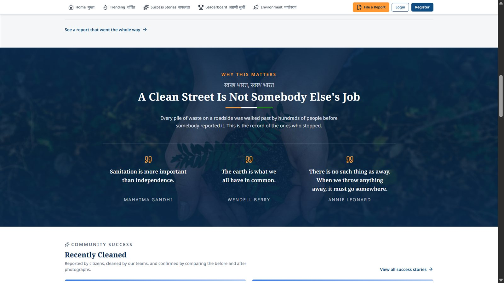
<br /><b>02 · Home — why this matters</b><br />
<sub>An editorial band (Gandhi, Wendell Berry, Annie Leonard) sitting above <b>Recently Cleaned</b>, which pulls live from the public feed. Persuasion first, then proof — in that order, on purpose.</sub>
</td>
</tr>
<tr>
<td valign="top">
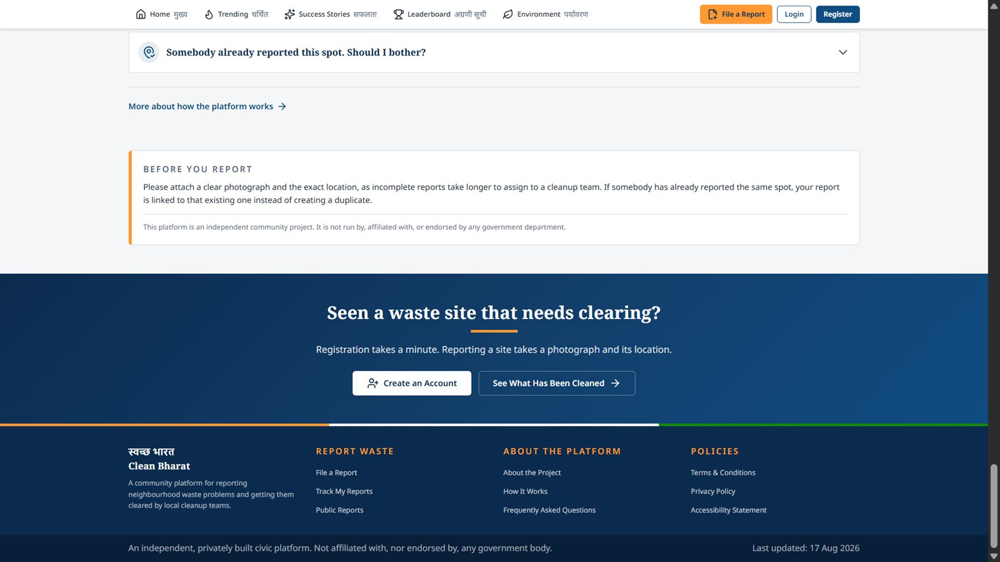
<br /><b>03 · Home — objections, answered</b><br />
<sub>The FAQ answers the question that actually stops people: <i>"Somebody already reported this spot. Should I bother?"</i> Beside it, a <b>Before You Report</b> card explains that a duplicate is linked to the original rather than thrown away. Below, a four-column footer with a visible <i>last updated</i> date.</sub>
</td>
<td valign="top">
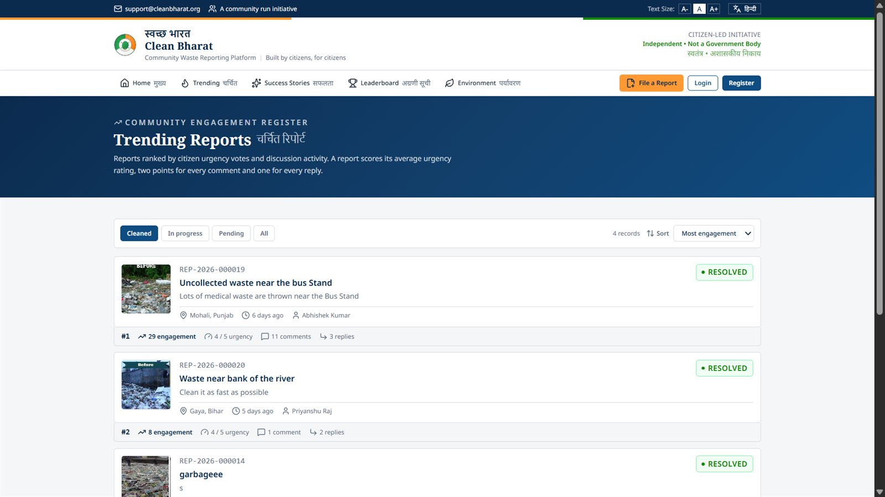
<br /><b>04 · Trending — the engagement register</b><br />
<sub>Ranked by a formula printed on the page itself: <b>urgency + (2 × comments) + (1 × replies)</b>. Status chips filter to Cleaned / In progress / Pending, and every row shows its full arithmetic — <code>29 engagement · 4/5 urgency · 11 comments · 3 replies</code> — so no ranking is unexplained.</sub>
</td>
</tr>
<tr>
<td valign="top">
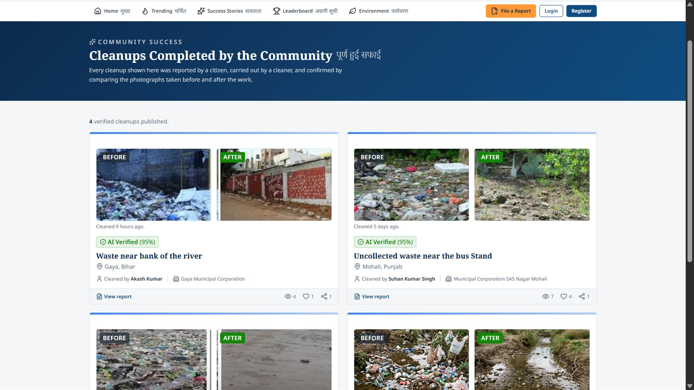
<br /><b>05 · Success Stories — the receipts</b><br />
<sub>Completed cleanups as <b>BEFORE / AFTER</b> pairs, each stamped with its <b>AI Verified</b> confidence and credited to the officer and municipal corporation that closed it. Views, appreciations and shares are counted here.</sub>
</td>
<td valign="top">
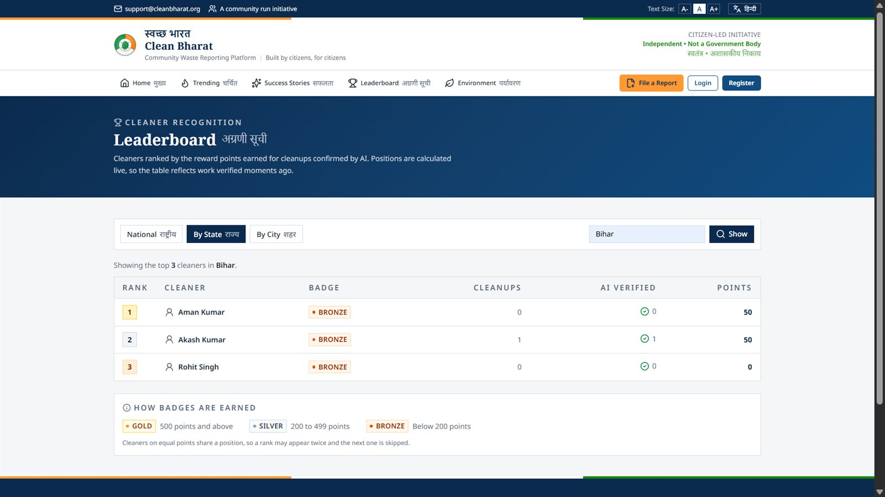
<br /><b>06 · Leaderboard — recognition, scoped</b><br />
<sub>National, by state or by city. Badge tiers are documented in place — <b>Gold 500+, Silver 200–499, Bronze under 200</b> — as is the ranking rule: equal points share a rank and the next rank skips, so repeated rank numbers are correct rather than a bug.</sub>
</td>
</tr>
<tr>
<td valign="top">
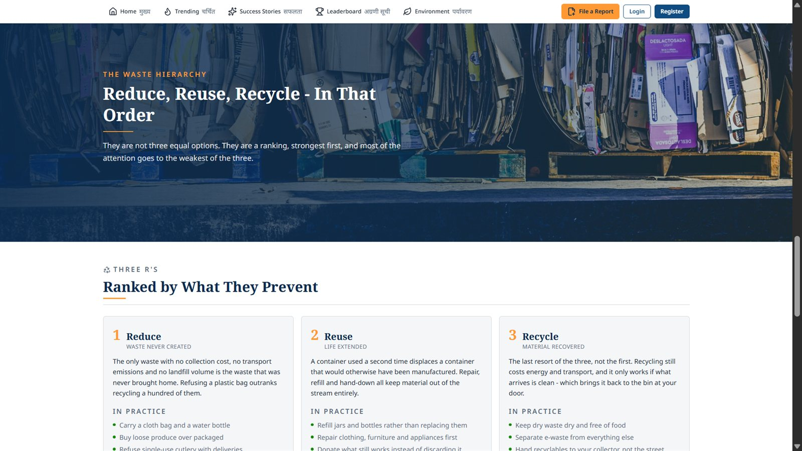
<br /><b>07 · Environment — guidance, not data</b><br />
<sub>The waste hierarchy, ordered by what each step actually prevents, with an <i>In practice</i> checklist under each of the three R's. Editorial content held in constants, so this page makes no API calls and reads perfectly while signed out.</sub>
</td>
<td valign="top">
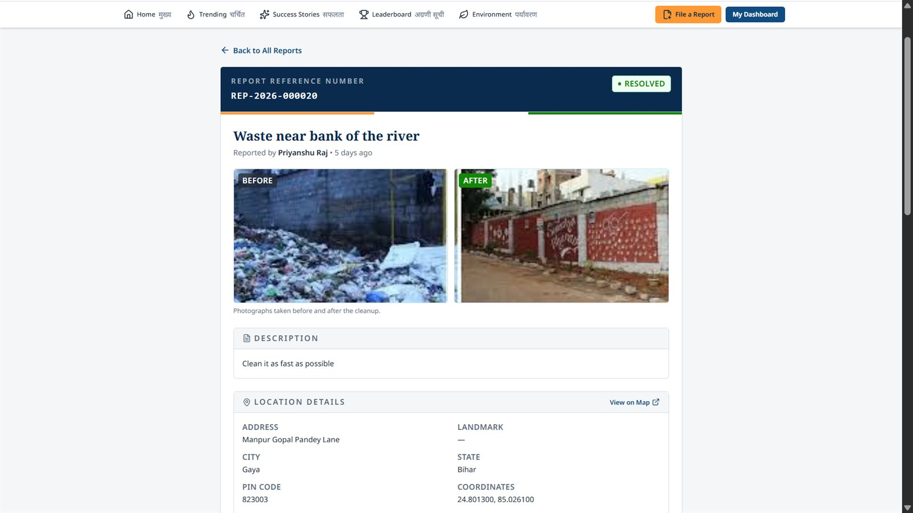
<br /><b>08 · Report detail — the case file</b><br />
<sub>Reference number and status in the header, before-and-after side by side, then the reporter's description and a full location block: address, landmark, city, state, pin code, coordinates and a <i>View on Map</i> link for whoever has to physically get there.</sub>
</td>
</tr>
<tr>
<td valign="top">
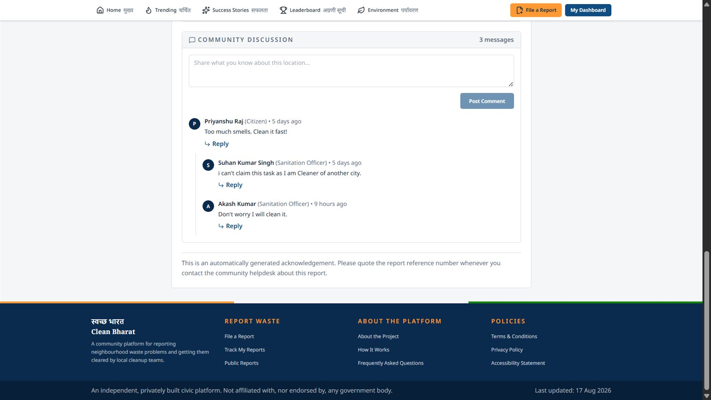
<br /><b>09 · Report detail — community discussion</b><br />
<sub>One level of threaded replies, with each participant's role shown beside their name, so <i>"I can't claim this task as I am cleaner of another city"</i> reads as an official answer rather than a stranger's opinion. Closing note reminds readers to quote the reference number when contacting the helpdesk.</sub>
</td>
<td valign="top">
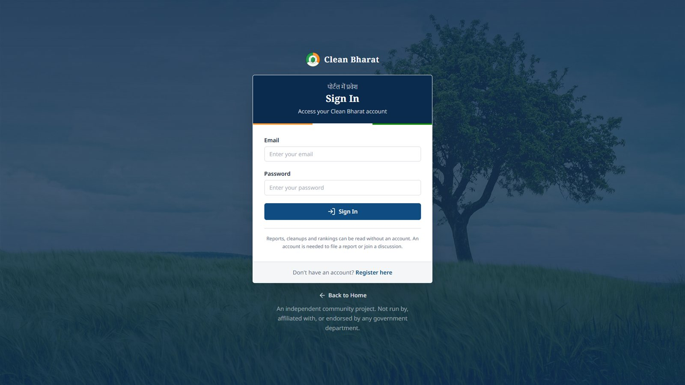
<br /><b>10 · Sign in</b><br />
<sub>A deliberately small form on a full-bleed photograph, restating under the button that reading needs no account and that <i>Back to Home</i> is always available. Nobody gets trapped at the gate.</sub>
</td>
</tr>
</table>

<div align="center">
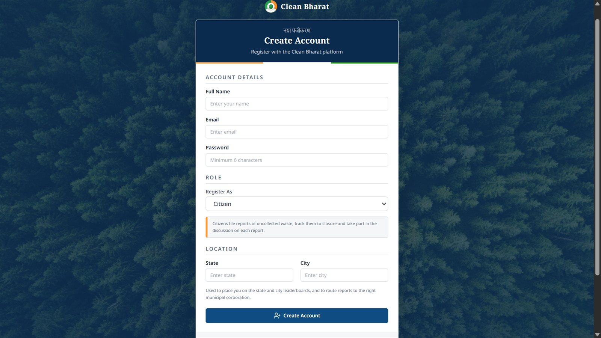
<br /><b>11 · Create account</b><br />
<sub>Grouped into <b>Account details → Role → Location</b>. Choosing a role reveals a plain-language description of what that role may do, and the location fields carry their own justification: <i>"used to place you on the state and city leaderboards, and to route reports to the right municipal corporation."</i> No field is asked for without a stated reason.</sub>
</div>

### Part two · Signed in — three dashboards, one shell

Once authenticated, every role gets the same chrome — breadcrumbs, a bilingual sidebar, an identity card naming the account and its role, and a helpdesk block pinned to the bottom — while the contents change completely.

<table>
<tr>
<td width="50%" valign="top">
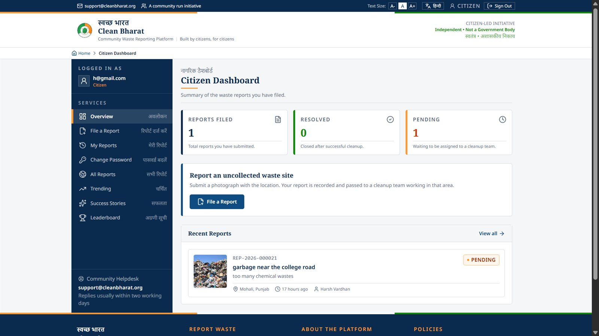
<br /><b>12 · Citizen dashboard</b><br />
<sub><i>Reports filed · Resolved · Pending</i>, a single prominent <b>File a Report</b> action, and the citizen's most recent submissions with status, place, age and assigned officer. The sidebar carries the community pages too, so a citizen never has to leave the shell to read Trending.</sub>
</td>
<td width="50%" valign="top">
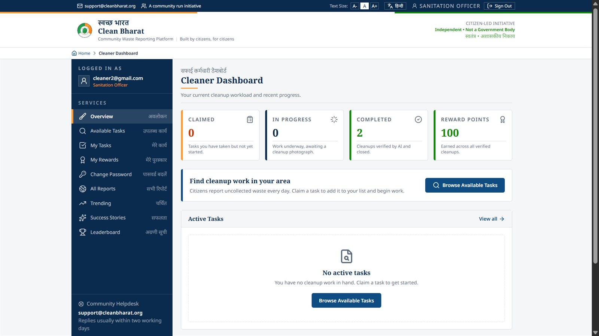
<br /><b>13 · Sanitation officer dashboard</b><br />
<sub>The lifecycle as four counters — <i>Claimed · In progress · Completed · Reward points</i> — and an empty state that does the work of a prompt: <i>"No active tasks. Browse available tasks to get started."</i></sub>
</td>
</tr>
<tr>
<td valign="top">
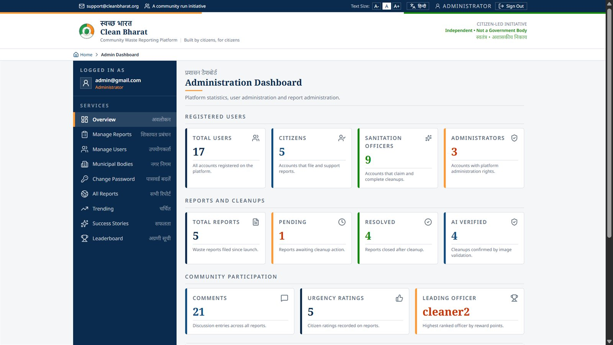
<br /><b>14 · Administration dashboard</b><br />
<sub>Three bands: <b>Registered users</b> broken out by role, <b>Reports and cleanups</b> including how many were AI-verified, and <b>Community participation</b> — comments, urgency ratings, and the current leading officer by reward points.</sub>
</td>
<td valign="top">
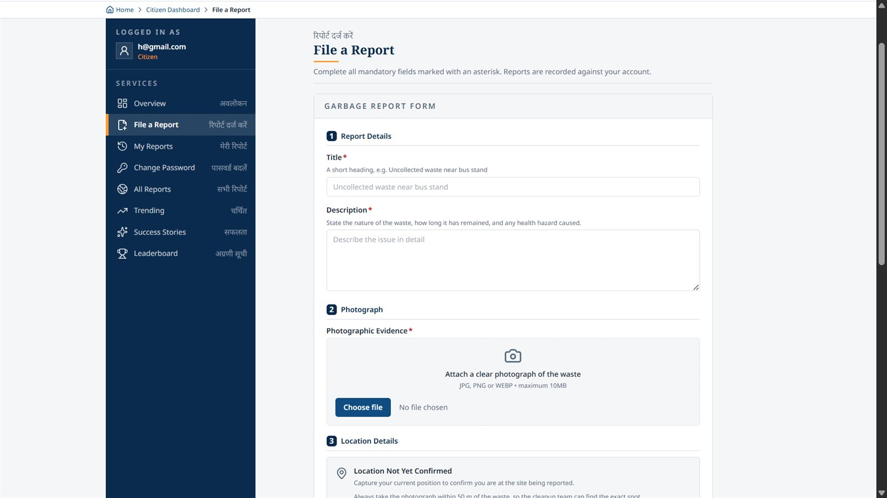
<br /><b>15 · File a report</b><br />
<sub>Numbered into <b>Report details → Photograph → Location details</b>. Every field carries an example rather than a rule. The location panel opens as <i>Location Not Yet Confirmed</i> and asks the reporter to capture their position from within ~50 m of the site — because a cleanup crew is going to be sent to that coordinate.</sub>
</td>
</tr>
</table>

---

## What each role can do

| | Visitor | Citizen | Sanitation Officer | Administrator |
|---|:---:|:---:|:---:|:---:|
| Read reports, trending, success stories, leaderboard | ✅ | ✅ | ✅ | ✅ |
| Read waste guidance, about, policies | ✅ | ✅ | ✅ | ✅ |
| Appreciate / share a published cleanup | ✅ | ✅ | ✅ | ✅ |
| File a report with photograph + verified location | — | ✅ | — | — |
| Rate urgency (1–5) on a report | — | ✅ | — | — |
| Comment and reply on any report | — | ✅ | ✅ | ✅ |
| Track own reports to closure | — | ✅ | — | — |
| Browse and claim unassigned cleanup work | — | — | ✅ | — |
| Start work, upload after-photograph for AI verification | — | — | ✅ | — |
| Reward points, badge tier, own leaderboard standing | — | — | ✅ | — |
| Platform statistics dashboard | — | — | — | ✅ |
| Search / filter users, promote, delete | — | — | — | ✅ |
| Search / filter reports, delete with cascade | — | — | — | ✅ |
| Maintain municipal corporation directory | — | — | — | ✅ |
| Change own password | — | ✅ | ✅ | ✅ |

The UI never relies on this table as a security boundary. Roles are enforced by the API; the frontend simply avoids offering an action it knows will return `403`, and routes every restricted page through a `RoleRoute` guard so a hand-typed URL lands somewhere sensible instead of on a broken screen.

---

## The life of a report, from the UI side

```
  ①  FILED                ②  VALIDATED             ③  ASSIGNED
  ┌──────────────┐        ┌──────────────┐        ┌──────────────┐
  │ File a       │        │ AI checks    │        │ Queued to a  │
  │ Report       │ ─────► │ the image is │ ─────► │ municipal    │
  │ 3 steps      │        │ real waste   │        │ corporation  │
  └──────────────┘        └──────────────┘        └──────────────┘
   photo + geo             120s upload             citizen sees
   + draft saved           timeout, spoken         PENDING with
   locally                 rejection reasons       officer named
                                  │
                                  ▼
  ⑤  PUBLISHED            ④  CLEANED
  ┌──────────────┐        ┌──────────────┐
  │ Success      │ ◄───── │ Officer      │
  │ Stories +    │        │ claims,      │
  │ leaderboard  │        │ starts,      │
  │ points       │        │ uploads      │
  └──────────────┘        └──────────────┘
   before/after            AI compares
   with confidence         before ↔ after
```

**① Filed.** `CreateReportPage` walks three numbered sections and keeps a draft in local storage, so a dropped connection or an accidental back-navigation does not cost the reporter their description. `LocationVerificationPanel` refuses to report a coordinate it has not actually measured.

**② Validated.** Submitting waits on Gemini Vision, which is why the upload client uses a **120-second** timeout while the rest of the app uses the default. A rejection comes back as a reason, not a code — *this does not appear to show waste*, *this looks like a screenshot* — and is rendered as such.

**③ Assigned.** The citizen's own dashboard and `MyReportsPage` show the status chip and, once routed, the officer's name. `MunicipalContactPanel` surfaces who is responsible for that city.

**④ Cleaned.** An officer claims from `AvailableTasksPage`, works it from `MyTasksPage`, and closes it through `CleanupUploadDialog`. The after-photograph is compared with the original; a rejection returns the task to the officer rather than silently failing.

**⑤ Published.** A verified cleanup appears in Success Stories as a before-and-after pair with its confidence score, the officer's points update, and the leaderboard — computed on demand, with no cached ranking table — reflects it on the next read.

---

## Engineering notes

<details open>
<summary><b>Code splitting, with exactly one exception</b></summary>

<br />

Every page is `lazy()`-loaded behind a single `<Suspense>` boundary. Before this, a citizen filing a report downloaded the entire admin portal, and an admin downloaded the cleaner task screens, before either could see anything — and the build said so.

`HomePage` is the one page kept eager. It is where most visits and every crawler land, so making the first meaningful paint wait on a second round trip was the wrong trade. Layouts and guards stay static for the same reason: they are needed on the very first render.

One boundary rather than one per route, because only the page being navigated to is ever suspended — and a single boundary keeps the fallback identical everywhere instead of varying page by page.

</details>

<details>
<summary><b>The dual-mount pattern: community pages inside and outside the shell</b></summary>

<br />

Reports, Trending, Success Stories, the Leaderboard, Environment, About and Policies are each mounted **twice** — once publicly under `PublicLayout`, and once under `/app/...` inside the authenticated `MainLayout`.

```
/reports              →  public shell, header + footer
/app/reports          →  signed-in shell, sidebar + breadcrumbs
```

Not two implementations: one component, two surroundings. A signed-in officer who clicks *Trending* in the sidebar keeps the sidebar instead of being dropped onto the public site mid-task. `MainLayout` publishes an in-app flag through a `LayoutMode` context, and the pages adjust their heading level and internal link targets accordingly — which is what stops an in-app page from linking a reader back out to `/reports/42`.

Guards compose top-down rather than repeat per route:

```
ProtectedRoute  →  MainLayout  →  RoleRoute allowedRole="ROLE_ADMIN"  →  admin pages
                              →  RoleRoute allowedRole="ROLE_CLEANER" →  officer pages
                              →  (no role guard)                     →  community pages
```

</details>

<details>
<summary><b>Talking to the API</b></summary>

<br />

- One Axios instance in `api/axiosClient.js`. A request interceptor attaches the JWT; a response interceptor is the single place an expired session is detected and cleared, so no page contains logout logic.
- Every path lives in `constants/apiConstants.js`, documented with its backend security posture — which endpoints are `permitAll`, which fall through to `authenticated()`, which are `hasRole(...)`. A component never has to guess whether a call will work while signed out.
- `utils/errorMessage.js` reduces the various shapes a failure can arrive in — validation envelope, plain string body, network timeout — to one human sentence, so no screen ever prints `[object Object]`.
- Twelve thin service modules, one per domain (`reportService`, `voteService`, `commentService`, `cleanupService`, `rewardService`, `publicFeedService`, `analyticsService`, `leaderboardService`, `municipalCorporationService`, `adminService`, `authService`, `accountService`). Components call services; components never call Axios.

</details>

<details>
<summary><b>Forms: React Hook Form + Zod, kept out of the components</b></summary>

<br />

Validation rules live in `src/schemas/` (`authSchema`, `reportSchema`, `municipalCorporationSchema`) and are bound through `@hookform/resolvers`. The schema is the specification: the same rule produces the inline field error and blocks the submit, so the two can never disagree. Shared `ui/Input`, `ui/Textarea`, `ui/Button` and `ui/Alert` primitives keep error presentation identical across every form in the app.

</details>

<details>
<summary><b>Bilingual by construction, not by translation layer</b></summary>

<br />

`LanguageContext` holds the preference; `i18n/strings.js` holds the strings; the `BiText` component renders the English and Hindi forms together where both belong on screen at once — which is how the navigation, the section eyebrows and the page headings work. The choice persists across visits, and the accessibility text-size control (`A- / A / A+`) is a first-class header control rather than something buried in a settings page.

</details>

<details>
<summary><b>Small conveniences that took real thought</b></summary>

<br />

| Concern | Where it lives | What it does |
|---|---|---|
| Scroll behaviour | `components/layout/ScrollManager.jsx` | Mounted **beside** the route table, not inside it, so it survives every navigation and can actually remember where each page was left. Inside a `<Route>` it would remount and forget — the one thing it exists to do. |
| Losing a half-written report | `utils/reportDraft.js` | Persists the in-progress report locally and restores it on return. |
| Geolocation | `hooks/useGeoLocation.js`, `utils/geo.js`, `utils/locationVerification.js` | Requests a position, reports accuracy honestly, and marks a report *location confirmed* only when it genuinely is. |
| Offering actions that would fail | `utils/myVotes.js`, `utils/myComments.js`, `hooks/usePendingAssignmentReportIds.js` | Remember what this browser has already done, so the UI does not offer a second urgency rating or a claim that the API would reject. |
| Long lists | `hooks/usePagination.js` + `components/common/Pagination.jsx` | One pagination behaviour, reused by every list screen. |
| Dialogs | `hooks/useModalBehaviour.js` | Focus handling, escape-to-close and scroll locking in one place, for the upload dialog, the confirmations and the login prompt. |
| Destructive admin actions | `components/admin/ConfirmDialog.jsx` | Deleting a report also removes its image, votes, comments, assignment, reward history and feed analytics, and rolls back the officer's points. Nothing about it is undoable, so nothing about it is one click. |
| Asking a guest to sign in | `components/auth/LoginRequiredDialog.jsx` | Prompts at the point of use — the page stays where it is, and returns the reader to what they were doing. |
| A wrong URL | `pages/common/NotFoundPage.jsx` | A real 404 page, not a blank router outlet. |

</details>

---

## Project structure

```
WM Fronted/
├── docs/screenshots/            # the fifteen screens used in this README
├── public/                      # static assets, robots.txt
├── index.html                   # single HTML entry; title + meta live here
├── vite.config.js               # react + tailwind plugins, "@" alias, strictPort 5173
├── vercel.json                  # SPA rewrite, cache + security headers
├── eslint.config.js
└── src/
    ├── main.jsx                 # BrowserRouter + the context providers
    ├── index.css                # Tailwind entry + design tokens
    │
    ├── api/axiosClient.js       # the single HTTP client (JWT + error interceptors)
    ├── constants/               # API paths, enums, and all editorial copy
    │                            #   apiConstants · reportConstants · badgeConstants
    │                            #   assignmentConstants · engagementConstants
    │                            #   homeContent · aboutContent · environmentContent
    │                            #   policyContent · roleLabels · languageConstants
    ├── context/                 # Auth · Language · LayoutMode (+ split instances,
    │                            #   so provider files stay fast-refresh friendly)
    ├── hooks/                   # useAuth · useReports · useAssignments · useRewards
    │                            #   usePagination · useGeoLocation · useLanguage
    │                            #   useLayoutMode · useModalBehaviour
    ├── i18n/strings.js          # English + Hindi string pairs
    ├── schemas/                 # Zod validation, one file per form family
    ├── services/                # one module per API domain (12 of them)
    ├── utils/                   # formatters · errorMessage · geo · reportDraft …
    │
    ├── layouts/
    │   ├── PublicLayout.jsx     # header + footer, signed out
    │   └── MainLayout.jsx       # sidebar + breadcrumbs, signed in
    ├── routes/
    │   ├── AppRoutes.jsx        # the whole route table, heavily commented
    │   ├── ProtectedRoute.jsx   # requires a session
    │   ├── PublicRoute.jsx      # guest-only (login / register)
    │   └── RoleRoute.jsx        # requires a specific role
    │
    ├── components/
    │   ├── ui/                  # Button · Input · Textarea · Alert
    │   ├── common/              # StatCard · BiText · PageHeading · Pagination
    │   ├── layout/              # SiteHeader · SiteFooter · Sidebar · nav drawers
    │   │                        #   Breadcrumbs · PageContainer/Section/Intro
    │   │                        #   AccountControl · ScrollManager
    │   ├── auth/                # AuthShell · LoginRequiredDialog
    │   ├── reports/             # ReportCard · StatusBadge · EngagementBar
    │   │                        #   SortControl · UrgencyRating · ImageUploadField
    │   │                        #   BeforeAfterImage · LocationVerificationPanel
    │   │                        #   MunicipalContactPanel · ReportListStates
    │   ├── comments/            # CommentSection · CommentItem · CommentForm
    │   ├── cleanup/             # TaskCard · AssignmentStatusBadge · UploadDialog
    │   ├── rewards/             # RewardSummaryCard · RewardHistoryItem
    │   ├── leaderboard/         # LeaderboardTable · MyRankCard · ScopeSelector
    │   │                        #   RankMedal · BadgePill
    │   ├── feed/                # SuccessStoryCard · AppreciationBar
    │   │                        #   AiVerifiedBadge · HomeSuccessSection
    │   ├── home/ about/         # the editorial sections of the landing pages
    │   ├── environment/         # photo band · three R's · segregation · pledge
    │   ├── policies/            # PolicyDocument · PolicyJumpNav
    │   └── admin/               # RoleBadge · MunicipalCorporationForm · Confirm
    │
    └── pages/
        ├── public/              # Home · SuccessStories(+detail) · Leaderboard
        │                        #   Environment · About · Policies
        ├── auth/                # Login · Register
        ├── account/             # ChangePassword (shared by all roles)
        ├── reports/             # AllReports · TrendingReports · ReportDetail
        ├── citizen/             # Dashboard · CreateReport · MyReports
        ├── cleaner/             # Dashboard · AvailableTasks · MyTasks · MyRewards
        ├── admin/               # Dashboard · Users(+detail) · Reports
        │                        #   MunicipalCorporations(+create/edit)
        └── common/              # NotFound
```

The naming convention is worth stating once: `pages/` compose, `components/` render, `hooks/` hold behaviour, `services/` speak HTTP, `schemas/` define what is valid, and `constants/` hold everything that is copy rather than code. A page that fetches its own data with Axios, or a component with a URL literal in it, is a bug in this codebase — not a shortcut.

---

## Getting started

### Prerequisites

| | |
|---|---|
| **Node.js** | 20.19+ / 22.12+ (required by Vite 8) |
| **npm** | 10+ |
| **Backend API** | the `wastemanagement` Spring Boot service, running and reachable |

### Install and run

```bash
git clone <your-fork-url>
cd "WM Fronted"

npm install
npm run dev
```

The dev server binds **`http://localhost:5173`** with `strictPort: true`. This is not a stylistic choice — the backend's CORS configuration whitelists that exact origin, so if Vite silently rolled over to `5174` every API call would fail with an opaque CORS error. Failing loudly on a busy port is the better outcome.

### Configuration

Create a `.env.local` in the frontend root when you need to point at a non-default API:

| Variable | Required | Default | Purpose |
|---|:---:|---|---|
| `VITE_API_BASE_URL` | No | `http://localhost:8080` | Base URL of the Spring Boot API. Trailing slashes are trimmed automatically. |

That is the whole configuration surface. One variable, with a working default, so a fresh clone runs against a local backend with no setup at all.

> **Two things to keep in mind.** Vite only exposes variables prefixed `VITE_`, and it **inlines them at build time** — so changing the API URL on a host requires a rebuild, not a restart. And because anything inlined into a bundle is public by definition, no secret ever belongs in this file: API keys, the JWT signing secret and the Cloudinary credentials are the backend's business alone.

### Scripts

| Command | What it does |
|---|---|
| `npm run dev` | Dev server with hot module replacement on port 5173 |
| `npm run build` | Production build to `dist/` |
| `npm run preview` | Serves the built bundle locally — the honest check before deploying |
| `npm run lint` | ESLint 10 across the project |

---

## Deployment

Configured for **Vercel**, with `vercel.json` doing three jobs.

**1 · Client-side routing survives a refresh.** Every path that is not a real file is rewritten to `index.html`, so a reader who reloads on `/reports/42` — or opens a shared link to it — gets the app rather than a 404 from the CDN:

```jsonc
"rewrites": [
  { "source": "/((?!assets/|.*\\.[a-zA-Z0-9]+$).*)", "destination": "/index.html" }
]
```

**2 · Caching matched to how the files are named.** Vite fingerprints everything under `/assets`, so those are immutable for a year. `index.html` is the opposite case: it must be revalidated on every visit, or a returning visitor keeps loading the previous release's asset names.

| Path | `Cache-Control` |
|---|---|
| `/assets/*` | `public, max-age=31536000, immutable` |
| `/index.html` | `public, max-age=0, must-revalidate` |

**3 · Security headers on every response.** `X-Content-Type-Options: nosniff`, `X-Frame-Options: DENY`, `Referrer-Policy: strict-origin-when-cross-origin`, and a `Permissions-Policy` that denies camera and microphone outright while allowing `geolocation=(self)` — which the report form genuinely needs and nothing else does.

**Build settings.** Root directory `WM Fronted`, build command `npm run build`, output directory `dist`. Set `VITE_API_BASE_URL` in the project's environment variables and redeploy — remember it is inlined at build time.

---

## Roadmap

- [ ] **PWA + offline capture** — waste sites are often photographed where the signal is worst; queue the report and submit when connectivity returns.
- [ ] **Map view** of the report queue, clustered by city, alongside the existing list and coordinate link.
- [ ] **Push / email notifications** so a citizen learns their report was resolved without opening the site.
- [ ] **More languages**, using the existing `BiText` + `strings.js` seam rather than a new abstraction.
- [ ] **Component tests** (Vitest + Testing Library) starting with the guards, the report form and the pagination hook.
- [ ] **Skeleton loaders** in place of the current suspense fallback on the data-heavy list pages.
- [ ] **TypeScript migration**, incrementally, beginning with `services/` and `schemas/` where the contracts are already explicit.

---

## Acknowledgements

The **Swachh Bharat Mission** for the vocabulary this project borrows, and for making municipal cleanliness a subject ordinary people feel entitled to talk about.

**React**, **Vite**, **Tailwind CSS**, **React Router**, **React Hook Form**, **Zod**, **Axios** and **Lucide** — every one of them chosen because it stays out of the way.

The sanitation workers this platform tries to make visible. The leaderboard exists because their work is usually anonymous, and it should not be.

---

<div align="center">

### Author

**Suhan Kumar Singh**

*Full-stack developer · Spring Boot · React*

Backend API and AI pipeline: the companion **`wastemanagement`** repository.

<br />

**License** — released under the same terms as the Clean Bharat backend repository.

<br />

<sub>An independent, privately built civic platform.<br />Not affiliated with, nor endorsed by, any government body.</sub>

<br />

**स्वच्छ भारत, स्वस्थ भारत**

<sub>A clean street is not somebody else's job.</sub>

</div>